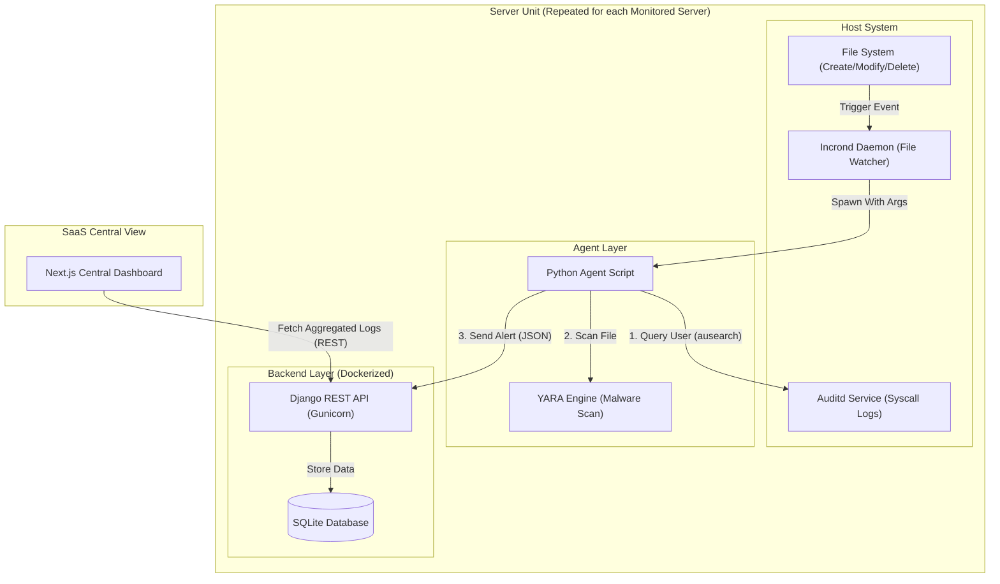

# 🛡️ Distributed Host Integrity Monitoring Platform (DHIMP)


> **Disclaimer**: This project is for portfolio and showcase purposes only. It demonstrates the design and logic of a FIM agent but requires additional hardening for production use.

## 📖 Overview

The **Distributed Host Integrity Monitoring Platform (DHIMP)** is a scalable security solution designed to monitor the integrity of files across multiple distributed servers from a single viewpoint.

The system uses a decentralized architecture where each monitored server functions as an independent unit containing its own **Agent** and **Backend Aggregator**. A **Centralized Dashboard** then connects to these distributed units, allowing administrators to monitor security events across the entire infrastructure through a single "Single Pane of Glass" interface.

## 🏗️ Architecture

Each monitored server operates as a self-contained unit (Agent + Backend + Infra). The Centralized Dashboard aggregates data from all these sources.



## 📂 Project Structure

```bash
.
├── agent/                         # [PER-SERVER] Host IDS Agent
│   ├── config/                    # Configuration templates
│   │   ├── crontab.example        # Example Cron jobs
│   │   └── incrontab.example      # Example Incron rules
│   ├── rules/                     # Detection Rules
│   │   └── yara-rules.yar         # YARA definitions for malware scanning
│   ├── src/
│   │   └── agent.py               # Main Logic: Watcher -> Audit -> YARA -> API
│   ├── requirements.txt           # Python dependencies (requests, yara-python)
│   └── README.md
│
├── backend/                       # [PER-SERVER] Local Data Aggregator
│   ├── api/                       # API Application
│   │   ├── views.py               # Endpoints (Ingest, Analytics)
│   │   ├── models.py              # DB Schema (FimLog)
│   │   ├── serializers.py         # Data Validation
│   │   └── urls.py                # Router
│   ├── backend/                   # Project Settings
│   │   └── settings.py            # Django Config (SQLite, JWT)
│   ├── docker-compose.yml         # Services: Backend, Prometheus, Grafana, Node-Exporter
│   ├── Dockerfile                 # Gunicorn Production Build
│   └── manage.py
│
├── frontend/                      # [CENTRALIZED] Analytical Dashboard
│   ├── src/
│   │   ├── app/                   # Next.js App Router (Dashboard, Login)
│   │   ├── components/            # UI Components (Visx Charts, Lucide Icons)
│   │   └── lib/                   # Utils
│   ├── public/                    # Static Assets
│   ├── Dockerfile                 # Production Docker Build
│   ├── next.config.ts             # Next.js Config
│   ├── tailwind.config.js         # Styling Config
│   └── package.json
│
├── infra/                         # Deployment Automation
│   ├── deploy-backend.yml         # Ansible Playbook for Backend
│   └── inventory.ini              # Server Inventory
│
└── montly-reports/                # Reporting Assets
```

## ✨ Key Features

### 🔍 Advanced Detection Capabilities

- **Event-Driven Monitoring**: Uses `incron` (inotify) to trigger the agent _immediately_ when file system events occur (Create, Modify, Delete), ensuring near-real-time detection without the overhead of polling.
- **Syscall Correlation (User Attribution)**: Goes beyond simple file watching by querying Linux Audit (`auditd`) logs to identify the specific **User (uid)** and **Process/Command (comm)** responsible for the change.
- **Malware Scanning (YARA)**: Integrated YARA engine scans modified files against a compiled ruleset to detect known malware signatures instantly.

### 🧠 Intelligent Logic

- **Smart Deduplication**: The agent includes logic to debounce rapid-fire events (e.g., from script execution) to prevent alert fatigue.
- **Context-Aware Filtering**:
  - **Office Hours**: Distinguishes between changes made during business hours vs. suspicious after-hours activity.
  - **Extension & Path Rules**: whitelist/blacklist support to ignore safe assets (images, logs) while focusing on high-risk files (php, sh, exe, system configs).

### ⚡ Distributed & Scalable Architecture

- **Decentralized Data Aggregation**: Each server manages its own logs via a local Dockerized Django Backend. This prevents a single point of failure for data ingestion.
- **Secure API Communication**: Agents communicate with their local backend via REST API, and the dashboard aggregates this data securely via JWT-authenticated requests.

### 📊 Modern Centralized Dashboard

- **Unified Visibility**: A single Next.js interface that aggregates health and security status from all connected servers.
- **Rich Analytics**: Visualizes trends using Visx charts, providing insights into total changes, malware detections, and suspicious activities over time.
- **Search & Filtering**: Deep dive into logs with filters for severity (Malware, Bahaya, Mencurigakan), date ranges, and filenames.

## 🛠️ Tech Stack

### 1. Monitoring Agent (Client-Side)

- **Language**: Python 3.10+
- **Kernel Event Listener**: `incron` (Inotify)
- **Audit Logging**: `auditd` + `ausearch` (User attribution)
- **Malware Engine**: `yara-python` (Signature-based detection)

### 2. Backend Aggregator (Server-Side)

- **Framework**: Django 5.0 (Django REST Framework)
- **Web Server**: Gunicorn (Production WSGI)
- **Database**: SQLite (Lightweight, per-node storage)
- **Authentication**: JWT (JSON Web Tokens) with HttpOnly Cookies
- **Containerization**: Docker & Docker Compose
- **Monitoring Stack**:
  - **Prometheus**: Metrics collection
  - **Grafana**: System performance visualization
  - **Node Exporter**: Hardware metrics

### 3. Centralized Dashboard (Frontend)

- **Framework**: Next.js 16 (App Router)
- **Language**: TypeScript
- **Styling**: Tailwind CSS 4
- **Charts**: Visx (Airbnb's visualization primitives)
- **Icons**: Lucide React
- **Containerization**: Docker (Multi-stage build)

---

## 🚀 Getting Started

### 1. Deploying a Server Unit (Agent + Backend)

Run this on **each** server you want to monitor.

```bash
# 1. Clone & Configure Infra
cd infra
ansible-playbook -i inventory.ini deploy-backend.yml

# 2. Manual Start (if not using Ansible)
cd backend
docker-compose up -d --build
```

_This starts the Local Backend Aggregator (Gunicorn/Django) and Monitoring Stack (Prometheus/Grafana)._

### 2. Configure the Agent

On the same server, set up the agent to talk to the Local Backend.

```bash
cd agent
pip install -r requirements.txt
# Ensure agent.py points to http://localhost:8000/api
```

### 3. Deploy Centralized Dashboard

Run this once on your admin machine or central server.

```bash
cd frontend
cp .env.local.example .env.local
```

Edit `.env.local` to list all your monitored servers:

```env
NEXT_PUBLIC_API_MAIN=https://server1.com/api
NEXT_PUBLIC_API_SERVER2=https://server2.com/api
NEXT_PUBLIC_API_SERVER3=https://server3.com/api
```

Start the dashboard:

```bash
npm install
npm run dev
# OR with Docker
docker build -t fim-dashboard . && docker run -p 3000:3000 fim-dashboard
```

## ⚠️ Notes

- Ensure the **Centralized Dashboard** has network access to the **Backend Aggregator** ports (default: 8000) on all monitored servers.
- Use HTTPS in production to secure the data in transit between Server Units and the Dashboard.
